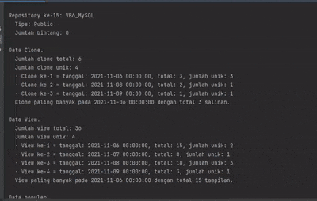

## Melihat data statistik repository Github
###### Developed by [Galih Hermawan](https://galih.eu).
---

Tutorial melihat data statistik repository github tersedia dalam [Blog](https://blog.galih.eu/melihat-statistik-repository-github-menggunakan-python-dan-pygithub).

**Spesifikasi pengujian.**
- Python 3.9
- Paket library: PyGithub 1.55

***Perhatian!***
> Jangan lupa isi 
    ```
    g = Github("token")
    ```
    dengan token pribadi Anda di GitHub.
	
	
Contoh luaran.

